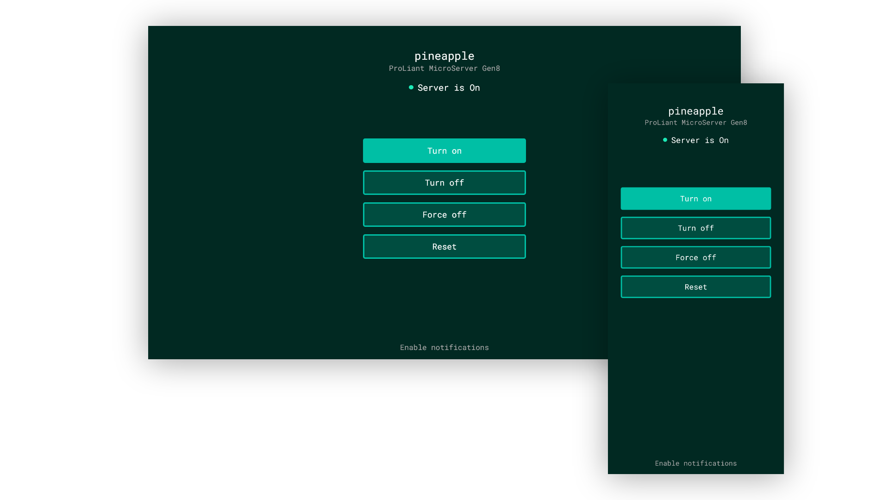

# hp-ilo-powerswitch
simple power control for hp integrated lights out through a web browser



## about
hp proliant servers come with a management computer, hp ilo (integrated lights out) to control power of the server and manage the configuration of other aspects of the machine remotely. sadly the stock ilo webpage is kind of annoying to use when you only want quickly turn the machine on and off, especially when using a mobile device. luckily hp provides a restful api for controlling the ilo using a custom application. that is why i decided to create a small easy to use webapp i can host myself for controling the power of my server remotely.

this app is only tested using an hp proliant microserver gen8, so this might not work with every other device from the proliant line.

## installation/usage

### docker
i recommend using this app as a docker container, since i use it that way myself. currently there is no image available on any container registry, so you are going to have to compile it yourself however.

1. clone the project and navigate to its folder
    ```bash
    git clone https://github.com/mertyn/hp-ilo-powerswitch.git
    cd hp-ilo-powerswitch
    ```
2. compile the image
    ```bash
    docker build -t hp-ilo-powerswitch .
    ```
3. run a container using the image <br>
    you can start a container using docker run, but using docker compose is more pleasant to use. you can use this code as a base config in your `docker-compose.yml`
    ```yaml
    version: "3"

    services:
        powerswitch:
            container_name: hp-ilo-powerswitch
            image: hp-ilo-powerswitch

            network_mode: "host"
            ports:
            - 5000:5000
            environment:
                # specify values without quotes
                - ILOHOST=<ilo-address>
                - ILOUSER=<ilo-username>
                - ILOPASS=<ilo-password>
                - SERVERTOKEN=<servertoken>     # only needed when using boot notification
                - PORT=5000
    ```

### native nodejs
1. **install dependencies**
    ```bash
    npm install
    ```
    **important note when running on windows**: after downloading the dependencies a script for generating a https certificate will run. this will result in an error when using windows, so the script `postinstall` in `package.json` will need to be disabled. in addition generating the certificate will be a bit more challenging. i recommend using [windows subsystem for linux (wsl)](https://learn.microsoft.com/en-us/windows/wsl/install)

2. **set up configuration**<br>
    the app is configured using environment variables. the easiest way to set these is to create a file called `.env` in the root directory of the project containing these parameters:
    ```bash
    PORT=5000
    ILOHOST="<ilo-address>"
    ILOUSER="<ilo-username>"
    ILOPASS="<ilo-password>"
    SERVERTOKEN="<servertoken>"     # only needed when using boot notification
    ```

3. **build and run the application**
    ```bash
    npm run build   # only needs to be executed once before running start
    npm run start
    ```
    for development, both of these commands are combined into
    ```bash
    npm run dev
    ```

### boot notification
since my server needs some time to boot and get all services up and running, i added the ability to get notified as soon as the boot has finished. for this the app provides an endpoint at `https://<app-address>:<port>/api/notification`. for sending a notification to all connected clients the server simply needs to make a post request to this address. to improve security a bit, the server needs to send a token, which needs to have the same value as is set in the `SERVERTOKEN` environment variable. i have a simple systemd service set up on linux for this, that runs a script executing this post request using curl.

for running the request, create a script somewhere on your machine. for example here is mine called `ready.sh`:
```bash
#!/bin/bash

curl --request POST \
    --header "Content-Type: application/json" \
    --data '{"token":"%7f#u7dVD35YmPCq!$&w"}' \
    --insecure \
    https://<webapp-address>:5000/api/notification
```
since the app only uses self signed certificates for https, it is important to set the `--insecure` flag to make the request work.

to create the service, create a file called `ready.service` in `/etc/systemd/system`:
```ini
[Unit]
Description=Run script when everything is ready
After=network.target
Wants=network.target
After=multi-user.target
Wants=multi-user.target

[Service]
Type=simple
ExecStart=/path/to/ready.sh

[Install]
WantedBy=multi-user.target
```
make sure to replace the value of `ExecStart` with the path to your ready.sh script and you are set!

# development/contributing
although this application can still be improved and polished, it works well enough for my application and therefore i have ended development. if you have made any improvements feel free to make a pull request however and i will see if i want to adopt the changes in the project :)

## license